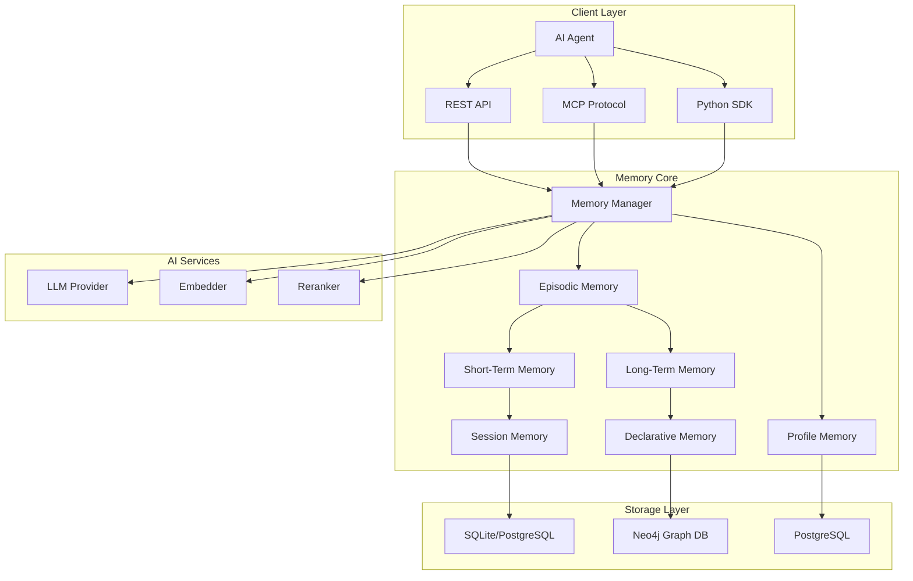
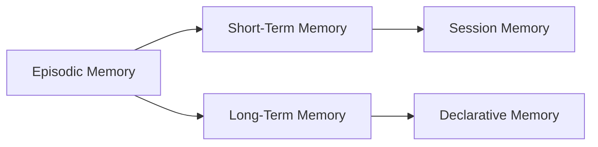
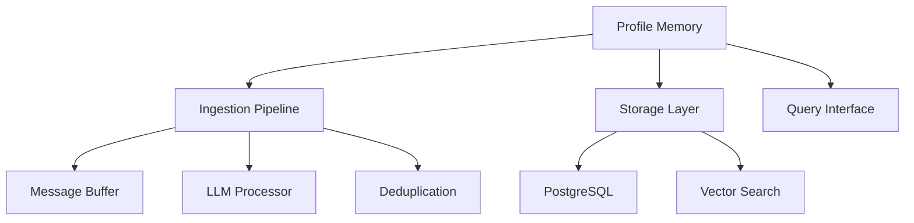
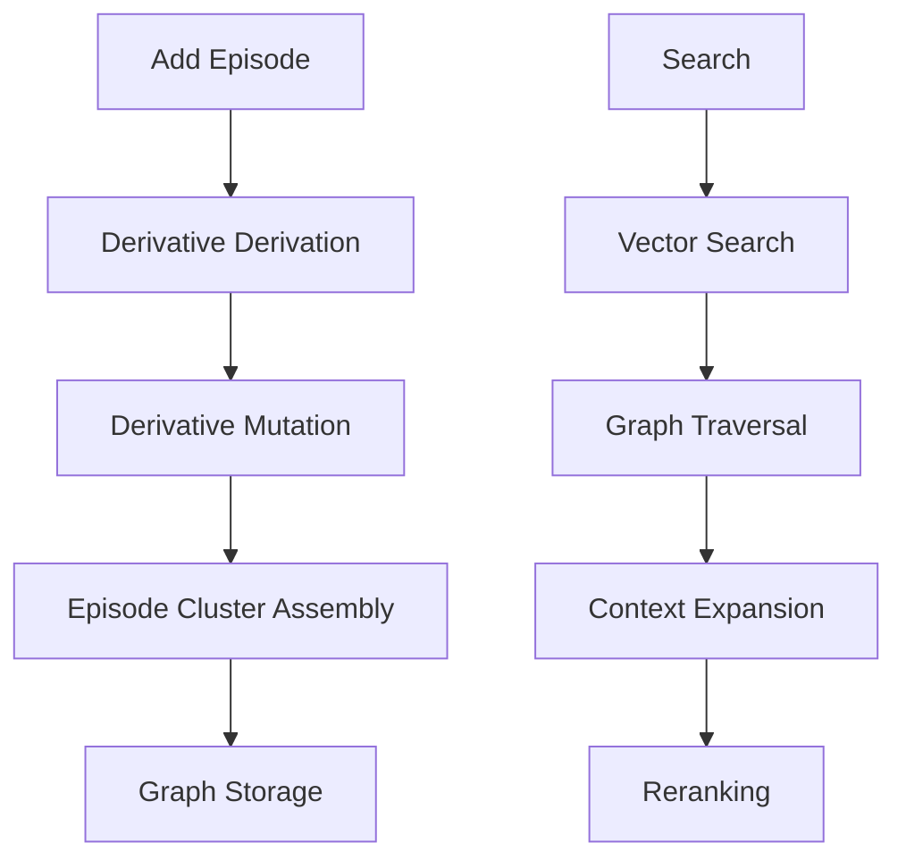
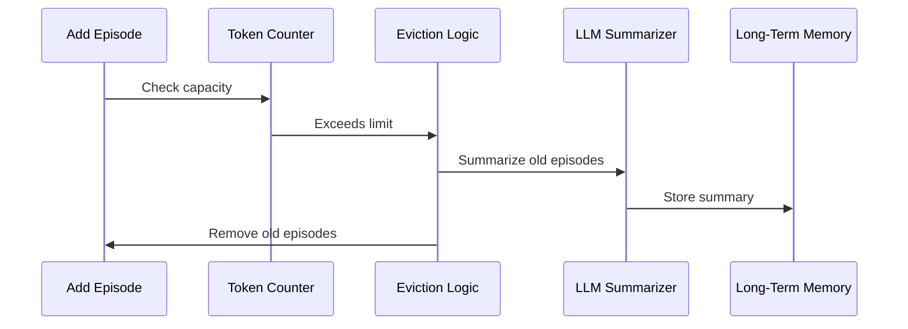
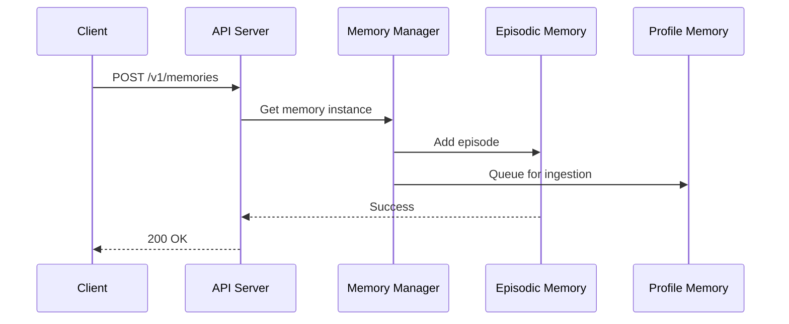
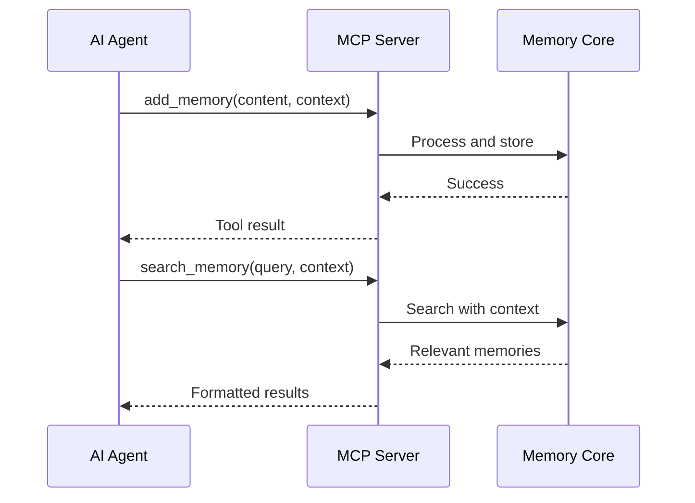
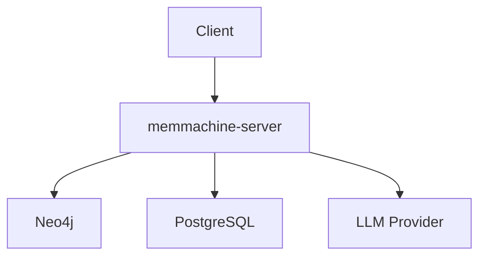

# System Architecture

## Overview

MemMachine implements a three-tier memory architecture for AI agents, combining short-term working memory, long-term episodic memory, and persistent profile memory. The system is designed as a pluggable memory layer that can integrate with any AI agent framework.

## High-Level Architecture

## Core Components

### 1. Memory Manager (`episodic_memory_manager.py`)

**Responsibilities:**
- Lifecycle management of memory instances
- Configuration loading and validation
- Session and group management
- Resource initialization and cleanup

**Key Operations:**
- `create_episodic_memory_instance()` - Create new memory context
- `get_episodic_memory_instance()` - Retrieve existing memory
- `close_episodic_memory_instance()` - Clean up resources
- `create_group()` - Initialize user/agent groups

### 2. Episodic Memory (`episodic_memory.py`)

**Architecture:**

**Components:**
- **Short-Term Memory:** Recent conversation context (token-limited buffer)
- **Long-Term Memory:** Persistent episodic storage with semantic search

**Key Operations:**
- `add_memory_episode()` - Store new episode
- `query_memory()` - Search with context formalization
- `formalize_query_with_context()` - Enhance queries with recent context
- `get_memory_context()` - Retrieve formatted context for LLM

### 3. Profile Memory (`profile_memory.py`)

**Purpose:** Learn and store long-term user facts, preferences, and characteristics

**Architecture:**

**Key Features:**
- Background ingestion of conversation history
- LLM-powered profile extraction
- Semantic search over user facts
- Citation tracking for provenance

**Key Operations:**
- `process_messages()` - Extract profile features from conversations
- `semantic_search()` - Find relevant user facts
- `add_new_profile()` - Store user profile data
- `get_user_profile()` - Retrieve complete profile

### 4. Declarative Memory (`declarative_memory.py`)

**Purpose:** Graph-based episodic storage with semantic relationships

**Architecture:**

**Processing Pipeline:**
1. **Derivative Derivation:** Extract searchable content from episodes
2. **Derivative Mutation:** Transform content (summarization, metadata extraction)
3. **Episode Cluster Assembly:** Create graph relationships
4. **Storage:** Persist to Neo4j vector graph

**Search Strategy:**
- Vector similarity search for initial candidates
- Graph traversal for related episodes
- Context expansion (previous/next episodes)
- Reranking for relevance scoring

### 5. Session Memory (`session_memory.py`)

**Purpose:** Token-limited buffer for recent conversation context

**Features:**
- Automatic eviction when token limit exceeded
- LLM-powered summarization of evicted content
- Maintains conversation continuity

**Eviction Strategy:**

## Storage Architecture

### Neo4j Graph Database (Episodic Memory)

**Node Types:**
- **Episode:** Individual memory units with embeddings
- **Derivative:** Processed/transformed episode content

**Relationships:**
- **RELATED_TO:** Semantic similarity
- **PREVIOUS/NEXT:** Temporal ordering
- **DERIVED_FROM:** Processing lineage

**Indexes:**
- Vector index on episode embeddings
- Property indexes on metadata fields

### PostgreSQL (Profile Memory)

**Tables:**
- `profile_features` - User facts and preferences
- `history_messages` - Conversation history buffer
- `citations` - Source tracking for profile features

**Extensions:**
- `pgvector` - Vector similarity search

### SQLite/PostgreSQL (Session Management)

**Tables:**
- `groups` - User/agent group definitions
- `users` - User identities
- `agents` - Agent identities
- `sessions` - Active memory sessions

## Integration Patterns

### REST API Integration

### MCP Protocol Integration

## Extensibility Points

### Custom Components

**Embedders:** Implement `Embedder` interface
- `ingest_embed()` - Generate embeddings for storage
- `search_embed()` - Generate query embeddings

**Language Models:** Implement `LanguageModel` interface
- `generate_response()` - Generate completions with tool support

**Rerankers:** Implement `Reranker` interface
- `score()` - Rerank search results

**Storage:** Implement `VectorGraphStore` or `ProfileStorageBase`
- Custom database backends

### Configuration-Driven Architecture

All components are instantiated via configuration files using the builder pattern:
- `EmbedderBuilder`
- `LanguageModelBuilder`
- `RerankerBuilder`
- `VectorGraphStoreBuilder`

## Deployment Architecture

### Docker Compose Deployment

**Services:**
- `memmachine-server` - Main API server
- `neo4j` - Graph database
- `postgres` - Profile storage

**Networking:**
- Internal network for service communication
- Exposed ports for client access

### Scaling Considerations

**Horizontal Scaling:**
- Stateless API servers (session state in database)
- Shared Neo4j and PostgreSQL instances

**Vertical Scaling:**
- GPU support for local embeddings
- Increased memory for larger session buffers

**Performance Optimization:**
- Connection pooling for databases
- Async I/O throughout
- Background processing for profile ingestion
