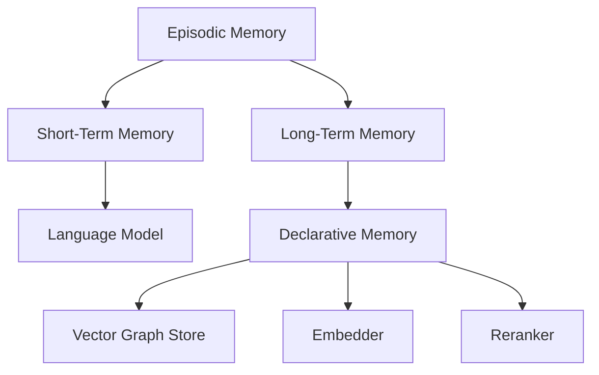
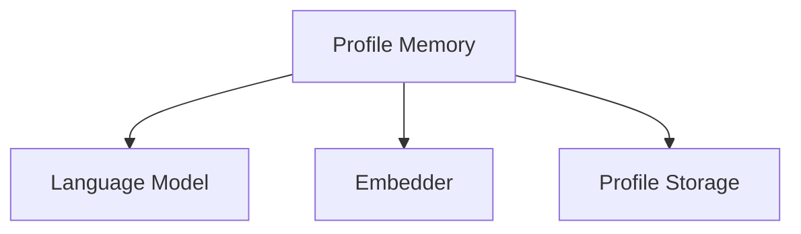
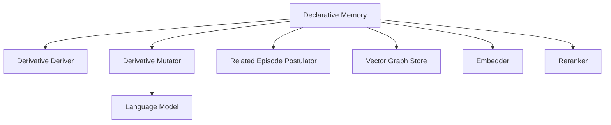

# Dependencies

## External Dependencies

### Core Runtime Dependencies

#### Web Framework
- **FastAPI** (0.116.1+)
  - Purpose: REST API framework
  - Usage: Server implementation (`src/memmachine/server/app.py`)
  - Features: Async support, automatic OpenAPI docs, validation

- **Uvicorn** (0.35.0+)
  - Purpose: ASGI server
  - Usage: Production server for FastAPI
  - Features: High performance, WebSocket support

- **FastMCP** (2.12.0+)
  - Purpose: Model Context Protocol implementation
  - Usage: MCP server (`src/memmachine/server/mcp_stdio.py`, `mcp_http.py`)
  - Features: Tool calling, stdio/HTTP transports

#### Database Drivers
- **Neo4j** (5.28.2+)
  - Purpose: Graph database driver
  - Usage: Episodic memory storage (`src/memmachine/common/vector_graph_store/neo4j_vector_graph_store.py`)
  - Features: Vector search, graph traversal, async support

- **AsyncPG** (0.30.0+)
  - Purpose: PostgreSQL async driver
  - Usage: Profile memory storage (`src/memmachine/profile_memory/storage/asyncpg_profile.py`)
  - Features: High performance, connection pooling

- **SQLAlchemy** (2.0.43+)
  - Purpose: ORM and database toolkit
  - Usage: Session management (`src/memmachine/episodic_memory/session_manager/session_manager.py`)
  - Features: ORM, migrations, multiple backends

- **PGVector** (0.4.1+)
  - Purpose: PostgreSQL vector extension support
  - Usage: Profile memory vector search
  - Features: Vector similarity operations

#### AI/ML Services
- **OpenAI** (1.104.2+)
  - Purpose: OpenAI API client
  - Usage: LLM and embeddings (`src/memmachine/common/language_model/openai_language_model.py`, `src/memmachine/common/embedder/openai_embedder.py`)
  - Features: GPT models, embeddings, function calling

- **Boto3** (1.40.40+)
  - Purpose: AWS SDK
  - Usage: Amazon Bedrock integration (`src/memmachine/common/language_model/amazon_bedrock_language_model.py`)
  - Features: Bedrock models, embeddings, reranking

- **LangChain-AWS** (0.2.32+)
  - Purpose: AWS integrations for LangChain
  - Usage: Bedrock utilities
  - Features: Model wrappers, prompt templates

- **Sentence Transformers** (5.1.0+, GPU optional)
  - Purpose: Local embedding models
  - Usage: GPU-accelerated embeddings (`src/memmachine/common/embedder/sentence_transformer_embedder.py`)
  - Features: BERT-based models, local inference

- **Rank-BM25** (0.2.2+)
  - Purpose: BM25 ranking algorithm
  - Usage: Keyword-based reranking (`src/memmachine/common/reranker/bm25_reranker.py`)
  - Features: Fast keyword matching

- **NLTK** (3.9.1+)
  - Purpose: Natural language processing
  - Usage: Text tokenization, sentence splitting
  - Features: Tokenizers, corpora

#### Data Validation
- **Pydantic** (2.11.7+)
  - Purpose: Data validation and settings
  - Usage: Throughout codebase for data models
  - Features: Type validation, JSON schema, settings management

#### Configuration
- **PyYAML** (6.0.2+)
  - Purpose: YAML parsing
  - Usage: Configuration file loading (`configuration.yml`)
  - Features: Safe loading, serialization

- **python-dotenv** (0.9.9+)
  - Purpose: Environment variable loading
  - Usage: `.env` file support
  - Features: Variable substitution

#### Monitoring
- **Prometheus Client** (0.22.1+)
  - Purpose: Metrics collection
  - Usage: API metrics (`src/memmachine/common/metrics_factory/prometheus_metrics_factory.py`)
  - Features: Counters, gauges, histograms, summaries

### Development Dependencies

#### Testing
- **pytest** (8.4.2+)
  - Purpose: Test framework
  - Usage: All tests in `tests/` directory
  - Features: Fixtures, parametrization, plugins

- **pytest-asyncio** (1.2.0+)
  - Purpose: Async test support
  - Usage: Testing async code
  - Features: Async fixtures, event loop management

- **testcontainers** (4.13.1+)
  - Purpose: Integration testing with containers
  - Usage: Neo4j and PostgreSQL integration tests
  - Modules: `testcontainers[neo4j,postgres]`
  - Features: Automatic container lifecycle

#### Code Quality
- **mypy** (1.18.2+)
  - Purpose: Static type checking
  - Usage: Type validation across codebase
  - Configuration: `pyproject.toml`
  - Features: Gradual typing, plugin support

- **ruff** (0.13.2+)
  - Purpose: Linting and formatting
  - Usage: Code style enforcement
  - Configuration: `pyproject.toml`
  - Features: Fast, comprehensive rules

## Internal Dependencies

### Component Dependencies

#### Episodic Memory Dependencies


**Episodic Memory** requires:
- Short-Term Memory (session memory)
- Long-Term Memory (declarative memory)

**Short-Term Memory** requires:
- Language Model (for summarization)

**Long-Term Memory** requires:
- Declarative Memory
- Embedder (for vector search)
- Reranker (for result scoring)
- Vector Graph Store (for persistence)

#### Profile Memory Dependencies


**Profile Memory** requires:
- Language Model (for feature extraction)
- Embedder (for semantic search)
- Profile Storage (PostgreSQL)

#### Declarative Memory Dependencies


**Declarative Memory** requires:
- Derivative Deriver (content extraction)
- Derivative Mutator (content transformation)
- Related Episode Postulator (relationship creation)
- Vector Graph Store (persistence)
- Embedder (vector generation)
- Reranker (result scoring)

**Derivative Mutator** may require:
- Language Model (for LLM-based mutation)

### Builder Dependencies

All builders follow the dependency injection pattern:

```python
class ComponentBuilder(Builder):
    def get_dependency_ids(self, config: dict) -> list[str]:
        """Return IDs of components this component depends on"""
        return [config.get("dependency_key")]
    
    def build(self, config: dict, dependencies: dict) -> Component:
        """Build component with resolved dependencies"""
        dependency = dependencies[config["dependency_key"]]
        return Component(dependency=dependency)
```

**Dependency Resolution:**
- `ResourceInitializer` performs topological sort
- Components initialized in dependency order
- Circular dependencies detected and rejected

## System Dependencies

### Required Services

#### Neo4j
- **Version:** 5.x+
- **Purpose:** Graph database for episodic memory
- **Required Plugins:** APOC (optional but recommended)
- **Configuration:**
  - Vector index support
  - Minimum memory: 2GB
  - Recommended memory: 4GB+

#### PostgreSQL
- **Version:** 14+
- **Purpose:** Profile memory and session storage
- **Required Extensions:**
  - `pgvector` - Vector similarity search
- **Configuration:**
  - Minimum memory: 1GB
  - Recommended memory: 2GB+

#### SQLite (Alternative)
- **Version:** 3.x+
- **Purpose:** Session storage (development/testing)
- **Limitations:** Not recommended for production

### Optional Services

#### LLM Providers
- **OpenAI API**
  - Models: GPT-4, GPT-3.5-turbo
  - Requires: API key
  
- **OpenAI-Compatible APIs**
  - Ollama (local)
  - vLLM (local)
  - Text Generation Inference
  - Requires: Base URL configuration

- **Amazon Bedrock**
  - Models: Claude, Titan, etc.
  - Requires: AWS credentials

#### Embedding Providers
- **OpenAI Embeddings**
  - Models: text-embedding-3-small, text-embedding-3-large
  - Requires: API key

- **Sentence Transformers**
  - Models: all-MiniLM-L6-v2, etc.
  - Requires: GPU (optional but recommended)

- **Amazon Bedrock Embeddings**
  - Models: Titan Embeddings
  - Requires: AWS credentials

### Runtime Requirements

#### Python
- **Version:** 3.12+
- **Reason:** Modern async features, type hints

#### Operating System
- **Linux:** Fully supported
- **macOS:** Fully supported
- **Windows:** Supported (WSL recommended for Docker)

#### Docker (Optional)
- **Version:** 20.10+
- **Docker Compose:** 2.0+
- **Purpose:** Containerized deployment

#### GPU (Optional)
- **CUDA:** 11.8+ (for Sentence Transformers)
- **Memory:** 4GB+ VRAM
- **Purpose:** Accelerated local embeddings

## Dependency Management

### Package Manager
- **uv** - Fast Python package installer
- **Alternative:** pip

### Lock File
- `uv.lock` - Pinned dependency versions
- Ensures reproducible builds

### Installation

```bash
# Install core dependencies
pip install memmachine

# Install with GPU support
pip install memmachine[gpu]

# Install development dependencies
pip install -e ".[dev]"
```

### Dependency Updates

```bash
# Update all dependencies
uv lock --upgrade

# Update specific package
uv add openai@latest
```

## Version Compatibility

### Python Version Support
- **Minimum:** 3.12
- **Tested:** 3.12, 3.13
- **Recommended:** 3.12+

### Database Version Support
- **Neo4j:** 5.x (5.28.2+ tested)
- **PostgreSQL:** 14+ (with pgvector)
- **SQLite:** 3.x

### LLM Provider Compatibility
- **OpenAI:** API v1 (1.104.2+ client)
- **Bedrock:** Latest boto3
- **OpenAI-Compatible:** OpenAI API v1 format

## Security Considerations

### Dependency Scanning
- Dependabot enabled (`.github/dependabot.yml`)
- Automatic security updates for vulnerabilities

### API Key Management
- Never commit API keys to repository
- Use environment variables or `.env` file
- `.env` file in `.gitignore`

### Database Security
- Use strong passwords
- Enable SSL/TLS for production
- Restrict network access
- Regular backups
