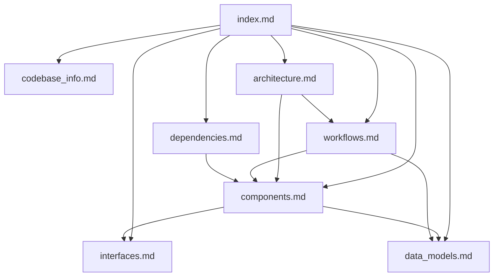

# MemMachine Documentation Index

## Purpose

This documentation provides a comprehensive knowledge base for AI assistants to understand and work with the MemMachine codebase. The documentation is organized into focused files covering different aspects of the system.

## How to Use This Documentation

**For AI Assistants:**
1. Start with this index file to understand the documentation structure
2. Use the summaries below to identify which files contain relevant information
3. Consult specific files based on your task:
   - Architecture questions → `architecture.md`
   - Component details → `components.md`
   - API integration → `interfaces.md`
   - Data structures → `data_models.md`
   - Process flows → `workflows.md`
   - Dependencies → `dependencies.md`

**Quick Reference:**
- **"How does X work?"** → Check `workflows.md` for process flows
- **"What does component Y do?"** → Check `components.md` for responsibilities
- **"How do I call API Z?"** → Check `interfaces.md` for API details
- **"What's the structure of data W?"** → Check `data_models.md`
- **"Why is the system designed this way?"** → Check `architecture.md`

## Documentation Files

### codebase_info.md
**Purpose:** High-level project overview and statistics

**Contains:**
- Project metadata (name, version, license)
- Technology stack and dependencies
- Directory structure overview
- Entry points and command-line tools
- Configuration file locations
- Supported platforms and providers
- API interface summary

**When to consult:**
- Getting started with the codebase
- Understanding project scope
- Finding entry points
- Identifying supported technologies

### architecture.md
**Purpose:** System design and architectural patterns

**Contains:**
- High-level architecture diagrams
- Core component relationships
- Memory tier architecture (short-term, long-term, profile)
- Storage architecture (Neo4j, PostgreSQL)
- Integration patterns (REST, MCP, SDK)
- Extensibility points
- Deployment architecture
- Scaling considerations

**When to consult:**
- Understanding system design decisions
- Planning new features
- Troubleshooting integration issues
- Optimizing performance
- Designing extensions

### components.md
**Purpose:** Detailed component documentation

**Contains:**
- Memory components (Episodic, Profile, Declarative, Session)
- AI service components (Embedders, LLMs, Rerankers)
- Storage components (Vector Graph Store, Profile Storage)
- Server components (REST API, MCP, SDK)
- Utility components (Resource Initializer, Metrics, Builders)
- Component responsibilities and interfaces
- Key methods and usage patterns

**When to consult:**
- Understanding specific component behavior
- Finding component interfaces
- Implementing new components
- Debugging component interactions
- Extending functionality

### interfaces.md
**Purpose:** API and integration interfaces

**Contains:**
- REST API endpoints and request/response formats
- MCP protocol tools and parameters
- Python SDK usage examples
- Configuration API and file formats
- Data type definitions for APIs
- Authentication and headers
- Error handling patterns

**When to consult:**
- Integrating with MemMachine
- Making API calls
- Using the Python SDK
- Configuring the system
- Understanding request/response formats

### data_models.md
**Purpose:** Data structures and models

**Contains:**
- Core data models (Episode, Identity, MemoryContext)
- Declarative memory models (Derivative, EpisodeCluster)
- Graph store models (Node, Edge)
- Profile memory models (ProfileFeature, HistoryMessage)
- Session management models (SQLAlchemy models)
- API request/response models
- Configuration models
- Metadata conventions
- Filtering syntax

**When to consult:**
- Understanding data structures
- Creating new episodes or memories
- Working with graph data
- Implementing storage backends
- Validating data formats

### workflows.md
**Purpose:** Process flows and operational procedures

**Contains:**
- Memory addition workflow (episodic and profile)
- Memory search workflow (episodic and profile)
- Session management workflow
- Configuration loading workflow
- Derivative processing workflow
- Docker Compose startup workflow
- Testing workflow
- Migration workflow (ChatGPT to MemMachine)
- Sequence diagrams for each workflow

**When to consult:**
- Understanding how operations work end-to-end
- Debugging process issues
- Implementing new workflows
- Optimizing performance
- Testing and deployment

### dependencies.md
**Purpose:** External and internal dependencies

**Contains:**
- External dependencies (FastAPI, Neo4j, OpenAI, etc.)
- Internal component dependencies
- System dependencies (databases, services)
- Dependency management (uv, pip)
- Version compatibility
- Security considerations
- Installation instructions

**When to consult:**
- Setting up development environment
- Understanding component relationships
- Troubleshooting dependency issues
- Updating dependencies
- Deploying to production

## Key Concepts

### Memory Architecture
MemMachine implements a three-tier memory system:
1. **Short-Term Memory:** Token-limited conversation buffer with automatic eviction
2. **Long-Term Memory:** Graph-based episodic storage with semantic search
3. **Profile Memory:** Persistent user facts and preferences

### Component Organization
- **Memory Layer:** Core memory implementations
- **AI Services:** Pluggable LLM, embedder, and reranker components
- **Storage Layer:** Database abstractions (Neo4j, PostgreSQL)
- **Server Layer:** REST API and MCP protocol servers
- **Client Layer:** Python SDK for integration

### Configuration-Driven Design
All components are instantiated via YAML configuration using the builder pattern, enabling:
- Pluggable implementations
- Easy provider switching
- Environment-specific configurations

### Async-First Architecture
The codebase uses async/await throughout for:
- Non-blocking I/O operations
- Concurrent request handling
- Background processing

## Common Tasks

### Adding a New Memory
1. Consult `interfaces.md` for API format
2. Check `data_models.md` for Episode structure
3. Review `workflows.md` for addition process
4. See `components.md` for component details

### Searching Memories
1. Consult `interfaces.md` for search API
2. Review `workflows.md` for search process
3. Check `components.md` for search components
4. See `data_models.md` for filter syntax

### Implementing a New Component
1. Review `architecture.md` for extensibility points
2. Check `components.md` for interface requirements
3. Consult `dependencies.md` for dependency management
4. See `workflows.md` for initialization process

### Deploying MemMachine
1. Review `architecture.md` for deployment options
2. Check `dependencies.md` for system requirements
3. Consult `workflows.md` for Docker Compose startup
4. See `codebase_info.md` for configuration files

### Troubleshooting Issues
1. Check `workflows.md` for process flows
2. Review `components.md` for component behavior
3. Consult `architecture.md` for system design
4. See `dependencies.md` for version compatibility

## File Relationships

**Reading Order for New Contributors:**
1. `codebase_info.md` - Project overview
2. `architecture.md` - System design
3. `components.md` - Component details
4. `interfaces.md` - API usage
5. `data_models.md` - Data structures
6. `workflows.md` - Process flows
7. `dependencies.md` - Setup and dependencies

## Metadata

**Generated:** 2026-03-25  
**Codebase Version:** 0.1.0  
**Documentation Format:** Markdown with Mermaid diagrams  
**Target Audience:** AI assistants and developers

## Updates and Maintenance

This documentation is generated from the codebase structure and should be regenerated when:
- Major architectural changes occur
- New components are added
- API interfaces change
- Dependencies are updated significantly

To regenerate, run the codebase summary SOP with the same parameters.
