# Workflows

## Memory Addition Workflow

### Episodic Memory Addition

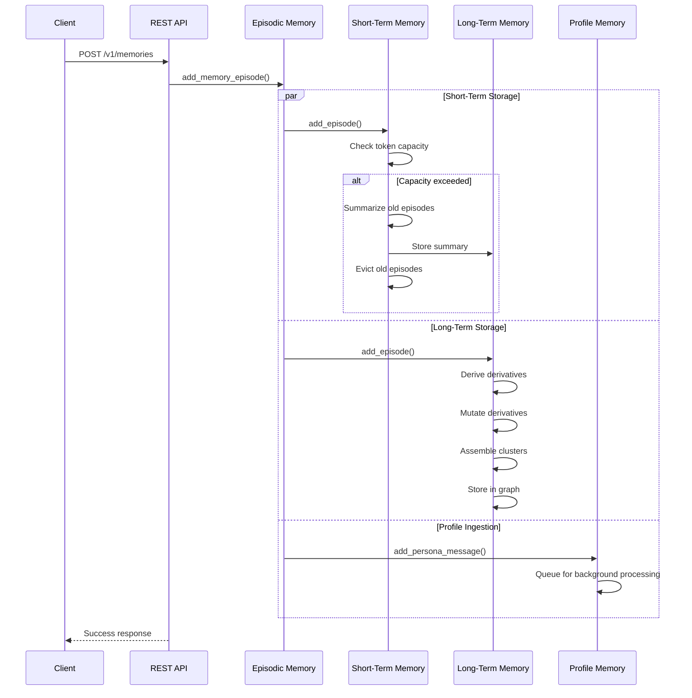

**Steps:**
1. Client sends episode to API
2. API validates and routes to episodic memory
3. Episode added to short-term memory (with eviction if needed)
4. Episode processed and stored in long-term memory graph
5. Episode queued for profile extraction
6. Success response returned to client

### Profile Memory Ingestion

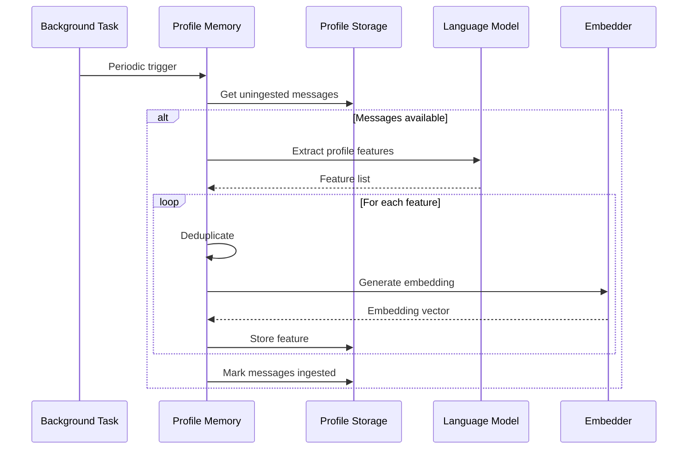

**Triggers:**
- Message count threshold (default: 10 messages)
- Time threshold (default: 5 minutes since first message)

**Steps:**
1. Background task checks for uningested messages
2. Messages retrieved from storage
3. LLM extracts profile features (facts, preferences, characteristics)
4. Features deduplicated against existing profile
5. Embeddings generated for semantic search
6. Features stored with citations
7. Messages marked as ingested

## Memory Search Workflow

### Episodic Memory Search

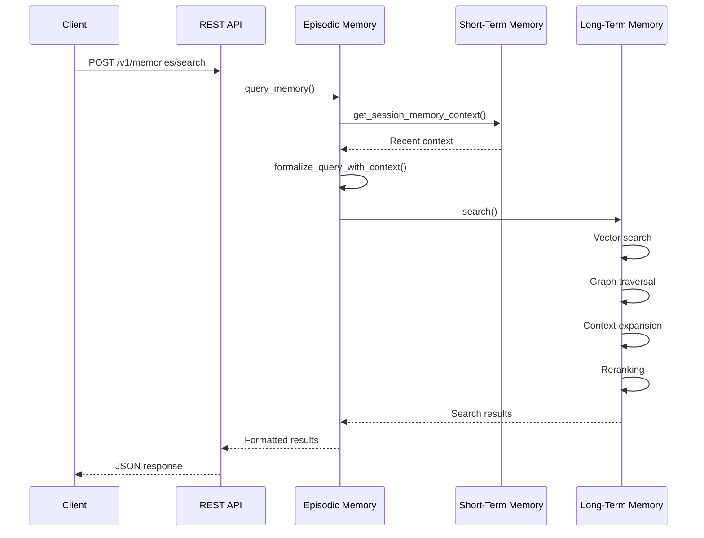

**Steps:**
1. Client sends search query
2. Recent context retrieved from short-term memory
3. Query formalized with context (LLM-enhanced)
4. Vector search finds similar episodes
5. Graph traversal finds related episodes
6. Context expansion includes previous/next episodes
7. Reranking scores final relevance
8. Results returned to client

### Profile Memory Search

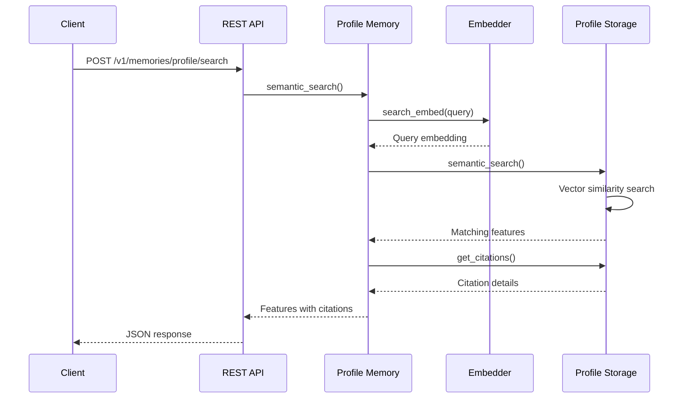

**Steps:**
1. Client sends search query
2. Query embedded using embedder
3. Vector similarity search in PostgreSQL
4. Matching features retrieved
5. Citations fetched for provenance
6. Results returned with source information

## Session Management Workflow

### Session Creation

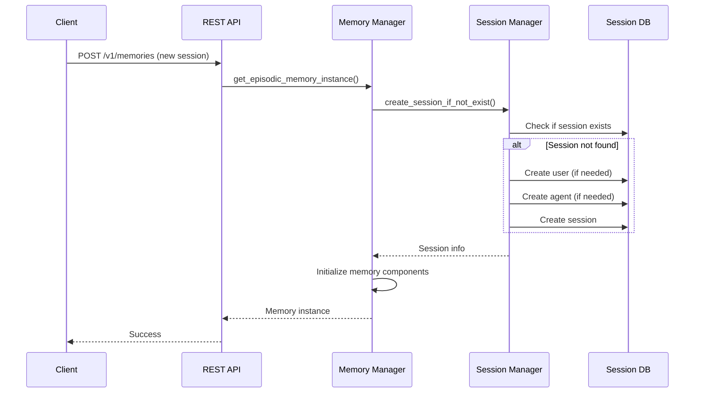

**Steps:**
1. Client makes request with session context
2. Manager checks for existing memory instance
3. Session manager checks database
4. User and agent created if needed
5. Session record created
6. Memory components initialized
7. Instance cached in manager

### Session Cleanup

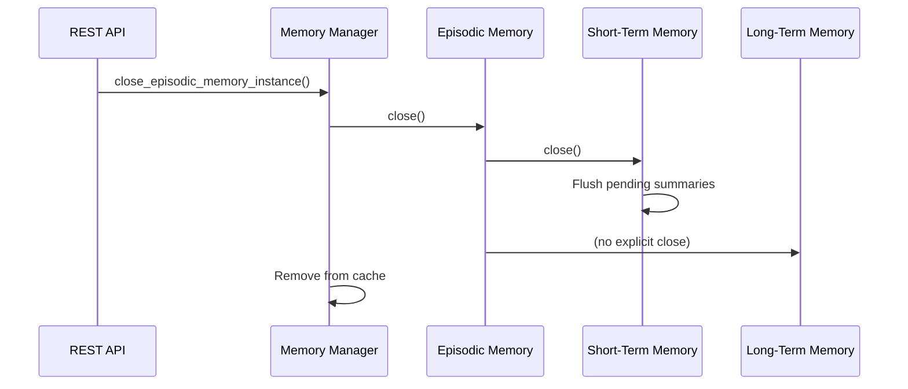

**Steps:**
1. API requests session closure
2. Manager retrieves memory instance
3. Short-term memory flushes pending data
4. Resources released
5. Instance removed from cache

## Configuration Loading Workflow

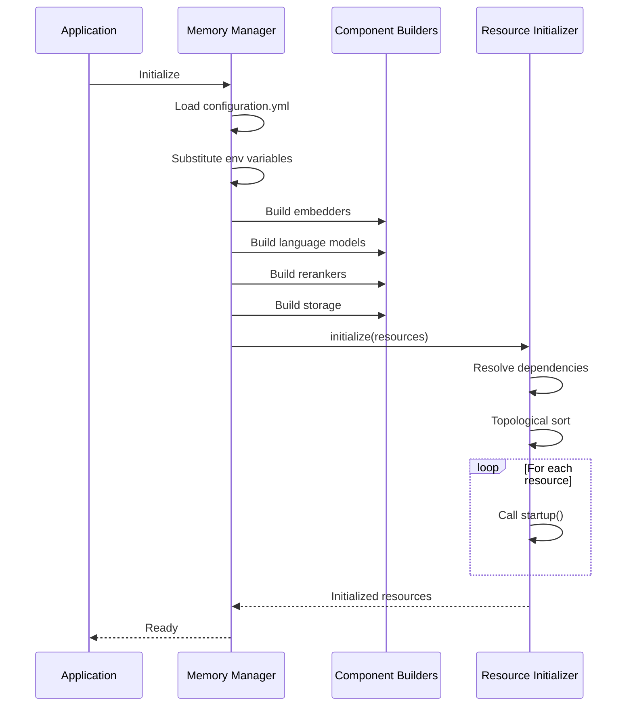

**Steps:**
1. Application starts
2. Configuration file loaded
3. Environment variables substituted
4. Component builders instantiate configured components
5. Resource initializer resolves dependencies
6. Components initialized in dependency order
7. System ready for requests

## Derivative Processing Workflow

### Derivative Derivation

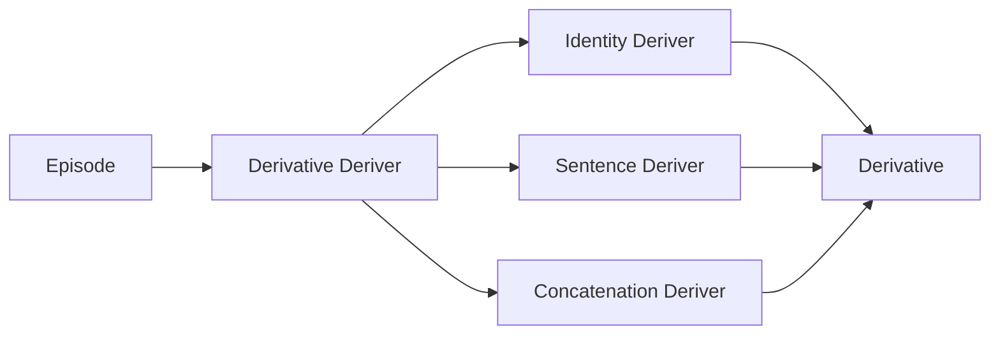

**Derivers:**
- **Identity:** Pass-through (no transformation)
- **Sentence:** Split into sentences
- **Concatenation:** Combine multiple episodes

**Purpose:** Extract searchable content from episodes

### Derivative Mutation

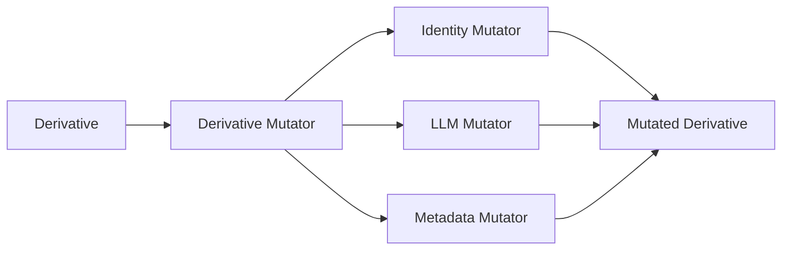

**Mutators:**
- **Identity:** No mutation
- **LLM:** Summarize or transform with LLM
- **Metadata:** Extract metadata fields

**Purpose:** Transform content for better search/storage

### Episode Cluster Assembly

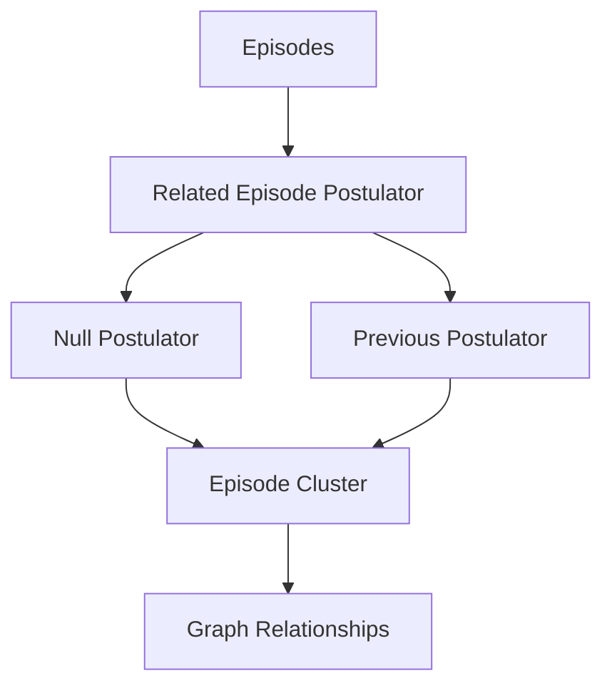

**Postulators:**
- **Null:** No relationships
- **Previous:** Link to previous episode in session

**Purpose:** Create graph structure for traversal

## Docker Compose Startup Workflow

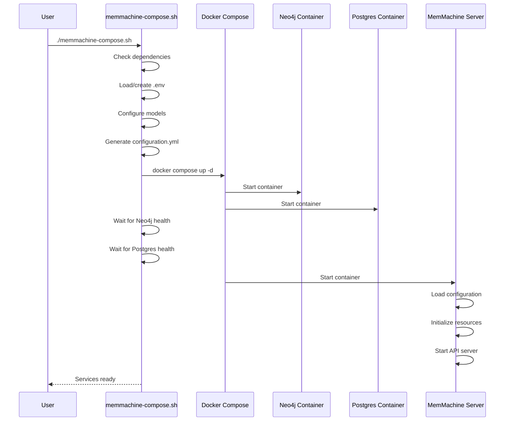

**Steps:**
1. User runs compose script
2. Script validates Docker installation
3. Environment file created/loaded
4. User selects LLM and embedding providers
5. Configuration file generated
6. Docker Compose starts services
7. Script waits for database health checks
8. MemMachine server starts
9. API ready for requests

## Testing Workflow

### Unit Test Execution

```bash
# Run all tests
pytest

# Run specific test file
pytest tests/memmachine/episodic_memory/test_episodic_memory.py

# Run with coverage
pytest --cov=memmachine

# Run integration tests only
pytest -m integration
```

### Integration Test Workflow

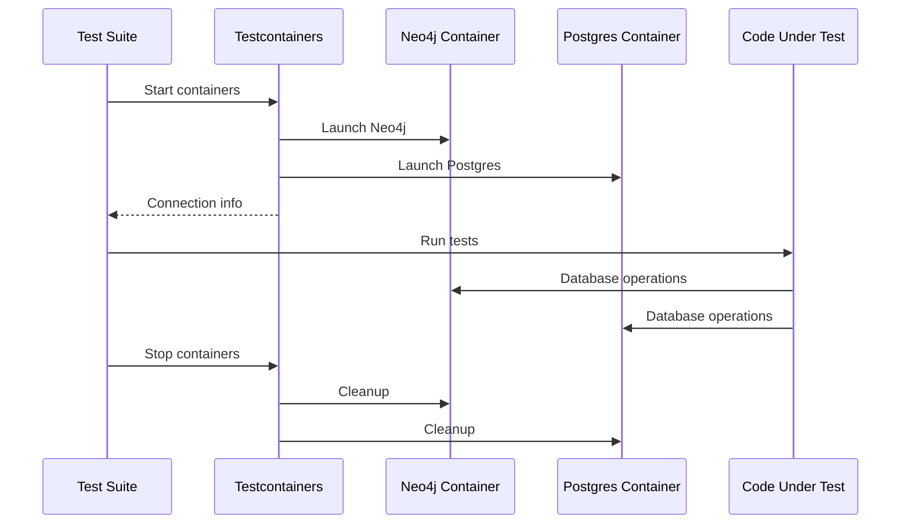

**Features:**
- Automatic container lifecycle management
- Isolated test environments
- Real database testing

## Migration Workflow (ChatGPT to MemMachine)

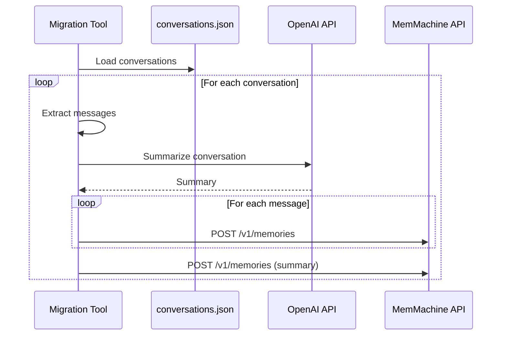

**Tool:** `tools/chatgpt2memmachine/migration.py`

**Steps:**
1. Load ChatGPT export file
2. Parse conversations
3. Generate summaries with OpenAI
4. Upload messages to MemMachine
5. Upload summaries as context
